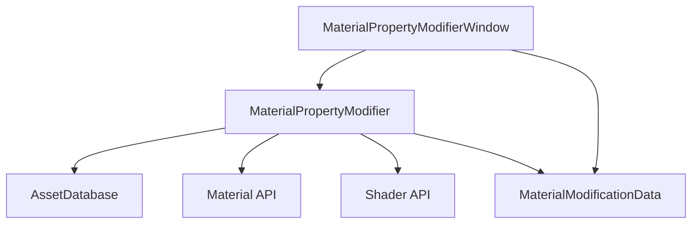

# Design Document

## Overview

The Material Property Modifier is a Unity editor tool that provides a window-based interface for bulk modification of material properties. The tool leverages Unity's AssetDatabase API for asset discovery, Material API for property manipulation, and EditorWindow for the user interface. The design follows Unity's editor tool patterns and provides a safe, preview-based workflow for material modifications.

## Architecture

The tool follows a Model-View-Controller (MVC) pattern adapted for Unity editor tools:

- **Model**: `MaterialModificationData` - Holds the current state of found materials, target properties, and modification settings
- **View**: `MaterialPropertyModifierWindow` - EditorWindow that renders the UI and handles user interactions  
- **Controller**: `MaterialPropertyModifier` - Core logic for material discovery, property validation, and modification operations



## Components and Interfaces

### MaterialPropertyModifierWindow (EditorWindow)

Primary UI component that provides:
- Folder selection field (using EditorGUILayout.ObjectField with folder constraint)
- Shader selection dropdown (populated from project shaders)
- Property name input field with validation
- Property value input (dynamic based on property type)
- Material list display with current/target values
- Preview and Apply buttons
- Progress bar for long operations

**Key Methods:**
- `OnGUI()` - Renders the complete UI
- `OnSelectionChange()` - Updates folder selection when Project window selection changes
- `ValidateInputs()` - Ensures all required fields are filled and valid
- `RefreshMaterialList()` - Triggers material discovery and updates display

### MaterialPropertyModifier (Core Logic)

Handles all material discovery and modification operations:

**Key Methods:**
- `FindMaterialsWithShader(string folderPath, Shader targetShader)` - Returns List<Material>
- `ValidateProperty(Shader shader, string propertyName)` - Returns PropertyValidationResult
- `GetPropertyType(Shader shader, string propertyName)` - Returns ShaderPropertyType
- `PreviewModifications(List<Material> materials, string propertyName, object targetValue)` - Returns ModificationPreview
- `ApplyModifications(List<Material> materials, string propertyName, object targetValue)` - Returns ModificationResult

### MaterialModificationData (Data Model)

Holds the current state and settings:

```csharp
public class MaterialModificationData
{
    public string SelectedFolderPath { get; set; }
    public Shader TargetShader { get; set; }
    public string PropertyName { get; set; }
    public object TargetValue { get; set; }
    public List<Material> FoundMaterials { get; set; }
    public ModificationPreview Preview { get; set; }
    public bool IsValid { get; set; }
}
```

### Supporting Classes

**PropertyValidationResult:**
- `bool IsValid`
- `string ErrorMessage`
- `ShaderPropertyType PropertyType`

**ModificationPreview:**
- `List<MaterialModification> Modifications`
- `List<string> SkippedMaterials`
- `int TotalCount`

**MaterialModification:**
- `Material TargetMaterial`
- `object CurrentValue`
- `object TargetValue`
- `bool WillBeModified`

## Data Models

### Material Discovery Flow

1. User selects folder in Project window or through object field
2. Tool scans folder recursively using `AssetDatabase.FindAssets("t:Material", folderPaths)`
3. For each material, check if `material.shader == targetShader`
4. Build list of matching materials with metadata

### Property Validation Flow

1. Get shader property count using `shader.GetPropertyCount()`
2. Iterate through properties using `shader.GetPropertyName(i)` and `shader.GetPropertyType(i)`
3. Validate property name exists and get its type
4. Validate target value is compatible with property type

### Modification Flow

1. Create preview showing current vs target values
2. User reviews and confirms changes
3. For each material:
   - Check if property exists using `material.HasProperty(propertyName)`
   - Apply value using appropriate `material.SetFloat()`, `material.SetColor()`, etc.
   - Mark material dirty using `EditorUtility.SetDirty(material)`
4. Save assets using `AssetDatabase.SaveAssets()`

## Error Handling

### Input Validation
- Empty folder selection: Display warning message
- Invalid shader selection: Clear material list and show error
- Invalid property name: Show error with available property names
- Invalid property value: Show type-specific error message

### Runtime Errors
- Asset loading failures: Log error and continue with other materials
- Read-only materials: Skip and add to skipped list with reason
- Property setting failures: Log error and continue with other materials
- Save failures: Display error dialog with retry option

### Error Recovery
- All operations are non-destructive until final Apply step
- Failed operations don't affect successfully processed materials
- Clear error states when inputs change
- Provide undo support through Unity's built-in undo system

## Testing Strategy

### Unit Testing
- Material discovery logic with mock folder structures
- Property validation with various shader types
- Value conversion and type checking
- Error handling scenarios

### Integration Testing
- End-to-end workflow with real Unity materials
- UI interaction testing with different input combinations
- Performance testing with large material collections
- Compatibility testing with different shader types (Built-in, URP, HDRP)

### Manual Testing Scenarios
1. **Basic Workflow**: Select folder → Choose shader → Set property → Preview → Apply
2. **Edge Cases**: Empty folders, materials without target shader, invalid properties
3. **Error Conditions**: Read-only materials, corrupted assets, interrupted operations
4. **Performance**: Large folders with hundreds of materials
5. **Shader Compatibility**: Standard, URP Lit, HDRP Lit, custom shaders

### Test Data Requirements
- Sample materials using different shader types
- Folder structures with nested materials
- Materials with various property configurations
- Read-only and corrupted material files for error testing